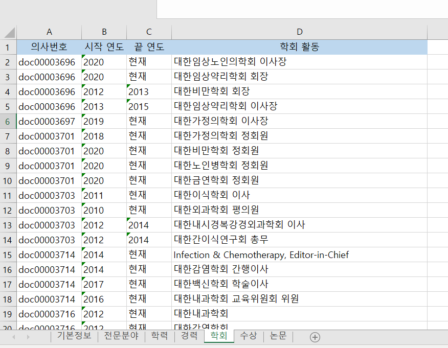
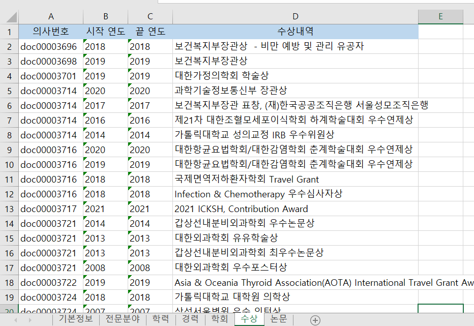

# Mediaipuls-Project
## - 프로젝트 개요
- 전국 상급병원에 있는 의사 정보를 제공해주는 서비스를 위한 데이터 베이스 구축
- 파이썬 웹 크롤링으로 데이터를 수집하였으며, 요류데이터 수정을 위해 엑셀로 출력
## - 동작 원리
## 1. 해당 병원 접속 후 진료과 리스트 페이지 접속
<br>


```python
res = requests.get('https://www.dcmc.co.kr/content/01reserv/01_01.asp', verify = False) # URL
soup = BeautifulSoup(res.text, 'html.parser')
dept_list = soup.select('div.ov')
dept_link = []
for i in dept_list :
    i = i.select('a')[1]
    link = 'https://www.dcmc.co.kr' + i["href"]
    dept_link.append(link)
```
- div 태그에 ov 클래스를 가지는 요소중에 a태그에 2번째 요소에 href 주소를 찾습니다.
- 'https://www.dcmc.co.kr' + 찾은 href를 합쳐 주어 dept_link에 배열에 삽입해 줍니다.
- requrest부분에 verify = False 속성 값은 SSL보안 인증서 무시를 의미합니다 


## 2. 해당 과 의사 리스트 페이지 접속
<br>


<br>

```python
doc_link = []
for i in dept_link :
    res = requests.get(i, verify = False)
    soup = BeautifulSoup(res.text, 'html.parser')
    real_link = soup.select('div.tar')
    for i in real_link : 
        i = i.select('a')[0]
        link = 'https://www.dcmc.co.kr' + i["href"] 
        doc_link.append(link)
```

- 찾은 학과 list 배열을 for문으로 구현해 의료진소개 href를 다시 doc_link에 삽입해줍니다.

<br>

## 3. 해당 의사에 접근

<br>


<br>
<br>

```python
for docter in doc_link :
    res = requests.get(docter, verify = False) # URL
    soup = BeautifulSoup(res.content, "html.parser", from_encoding='utf=8')
```    
- 찾은 의사 한명에 주소 값 리스트를 for문으로 돌려주면 전체 의사 데이터를 추출할수 있습니다.

<br>

## 4. 의사 데이터 추출


```python
    # 학력
    ws = wb.worksheets[2]
    ul_list = soup.select('ul.list')[0] 
    strong_del = ul_list.select('li strong')
    edu_content = ul_list.select('li')
    docter_arr = []
    docter_date = []
    docter_content = []

    for i in edu_content:
        date = i.select_one('strong')
        if date == None :
            docter_date.append('')
            docter_arr.append('')
        elif date != None:
            cnt = date.text.strip().replace(' ','').replace('-', '~').replace('년','.').replace('월','.').replace('/','.').split('~')
            if len(cnt) == 2 :
                docter_arr.append(cnt[0])
                docter_date.append(cnt[1])
            elif len(cnt) == 1 :
                docter_arr.append(cnt[0])
                docter_date.append(cnt[0])
    for i in strong_del : # strong 태그내용 제거
        i.extract()
    for i in edu_content :  
        i = i.text.strip().replace('\t','')
        docter_content.append(i)
    for tex in range(len(docter_content)):
        array = []
        array.append('doc' + str(doc_num).zfill(8))
        array.append(docter_arr[tex])
        array.append(docter_date[tex])
        array.append(docter_content[tex])
        ws.append(array)
```
- date부분을 ~을 구분자로 해서 split 할 경우 2015 ~ 2017 인 경우와 2015인 경우가 발생합니다.
- 그럴경우 len을 이용해서 split으로 나눈 후 첫번째 요소는 시작연도 2번째 요소는 끝연도에 삽입해줍니다.
- 날짜 데이터가 한개일 경우 시작연도와 끝연도를 동일한 데이터로 삽입합니다.
- 날짜 데이터가 없을 경우 '' 빈값을 넣어줍니다.
- date를 2개의 배열에 나누어 삽입한 뒤 2015 ~ 2017 내용 부분을 한 리스트로 만들어 준 뒤 엑셀에 삽입 합니다.

<br>

# 결과 

- 기본정보


- 학력


- 경력


- 학회활동



- 수상내역



- 논문


## PS.
- 각 병원마다 html구조는 다릅니다.
- 기본적으로 bs4를 사용했지만 정적웹페이지인 경우 selenium을 사용해야합니다.
- selenium을 사용할 경우 requests 시간이 bs4보다 오래 걸리기 때문에 time.sleep(2)초 정도 걸어 주어야합니다.
- 데이터 출력 후 date부분에 내용부분이 들어가 있는 경우도 있고, 의사 별로 작성하기 떄문에 오류데이터가 있으므로, 어느정도 전처리 과정을 해주어야 합니다.
